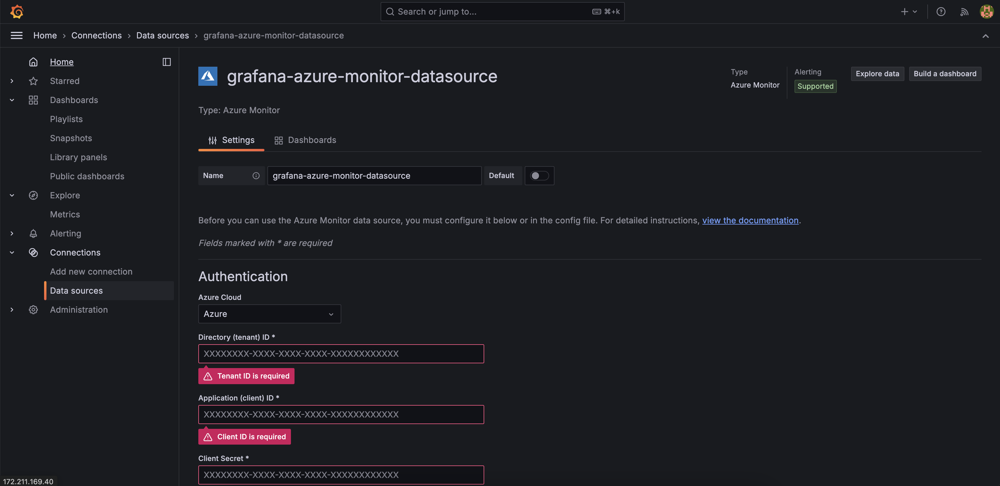
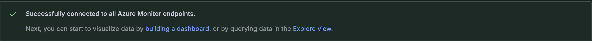
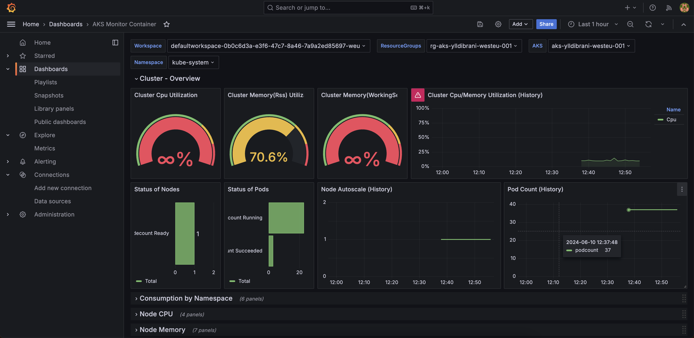

# Azure Monitor on Grafana

Connect to any azure resource and display on graph

First add Azure Monitor as Data Source in Grafana. Make sure you have an log analytics workspace resource created in Azure and linked to AKS.

Paste credentials from an Service Account created in Azure which has access on the Subscription and Azure Monitor services (Log Analytics Workspace).

Load Subscriptions in the tenant and select the subscription we want to monitor using Grafana. Press Save & Test and we will see this result:

Successfuly we have connected Azure Monitor to our Grafana hosted in Azure, let's create some visualizations regarding AKS (LAW is linked to AKS directly). I will import an ready made Dashboard from Grafana Dashboards blog.

This is how we can visualize resources from Azure to Grafana.