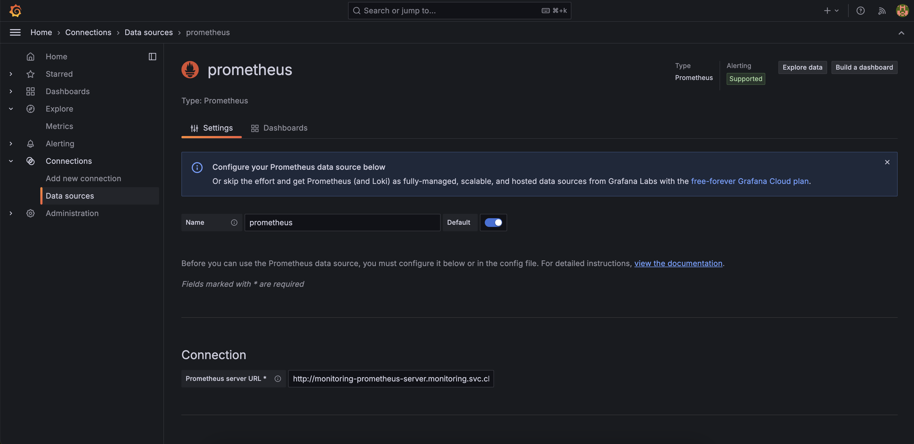
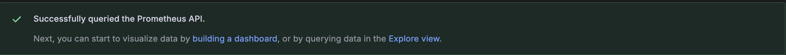

# Monitoring using Grafana and Prometheus

First step of this task need to start by installing Grafana and Prometheus using helm-chart in Kubernetes cluster.

```bash
  cd /helmFilePath/
  helm install monitoring . -n monitoring --create-namespace
```

Get the adminPassword of the grafana dashboard by managing secrets created from these dependencies. Usually it's named after the helm-chart name with the convention -<name of app> in this case "monitoring-grafana".

```bash
  kubectl get secrets -n monitoring

  NAME                  TYPE        DATA
  monitoring-grafana    Opaque      3
```

Let's decrypt it from base64 encryption as kubernetes does with secrets.

```bash
  kubectl get secret --namespace monitoring monitoring-grafana -o jsonpath="{.data.admin-password}" | base64 -d
```

After the results of correct secret/password let's login to the grafana dashboard using decrypted credentials and configure data sources to add Prometheus as our data source to send metrics to the grafana dashboard.



This is the result that we should get after Save & Test button clicked in grafana dashboard

